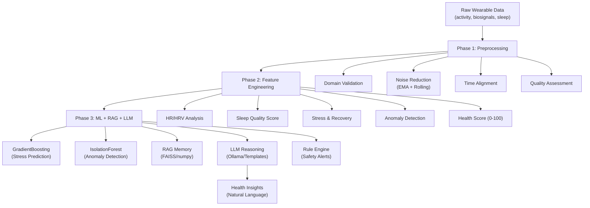

# 🏥 Samsung On-Device GenAI Health Assistant — Pipeline Walkthrough

## Pipeline Results Summary

| Metric | Value |
|--------|-------|
| **Total rows processed** | 150,000 (3 users × ~50K each) |
| **Total engineered features** | 45 columns |
| **Stress model R²** | 0.7099 (RMSE: 3.586) |
| **Anomaly detection rate** | 5.0% |
| **RAG memory entries** | 2,502 |
| **Pipeline duration** | ~69 seconds |
| **Temporal aggregations** | 5min, 15min, 1hour, daily |

---

## Architecture Overview



---

## Phase 1: Preprocessing — What Was Improved

| Aspect | Original `pre_processing.py` | Improved `pipeline/preprocessing.py` |
|--------|------------------------------|--------------------------------------|
| **Missing data** | Simple mean imputation | Time-aware interpolation + forward/backward fill per-user |
| **Outlier handling** | Blind IQR removal | Domain thresholds (HR: 30-220 bpm) + soft IQR clipping |
| **Noise reduction** | Basic rolling mean (window=5) | EMA for fast signals (HR/HRV), rolling for slow signals (SpO2) |
| **Time alignment** | None | Uniform resampling to 1-min grid |
| **Multi-user** | Not handled | Per-user processing to avoid cross-contamination |
| **Categorical data** | Ignored | Preserved (activity_level, sleep_stage) |
| **Streaming** | Not supported | `StreamingPreprocessor` with sliding window buffer |
| **Logging** | None | Full audit trail of every transformation |

---

## Phase 2: Feature Engineering — 25 Documented Features

### Heart-Related
- `hr_trend_5min` / `hr_trend_30min` — Short and long-term HR trends
- `hr_roc` — Rate of change (bpm/min)  
- `resting_hr` — 10th percentile at rest (~50 bpm for these users)
- `hrv_rmssd_proxy` / `hrv_sdnn_proxy` — HRV variability metrics

### Sleep
- `sleep_duration_min` — ~420 min/day (7 hours)
- `sleep_quality_score` — Composite 0-100 (deep ratio + REM + HRV + efficiency)
- `sleep_consistency` — Schedule regularity score

### Activity  
- `activity_intensity` — 0=sedentary, 1=low, 2=moderate, 3=high
- `step_intensity_15min` — Rolling 15-min step count
- `energy_expenditure_proxy` — MET-based kcal/min estimate

### Stress & Recovery
- `computed_stress` — HR↑ + HRV↓ composite (0-100)
- `recovery_score` — HRV + sleep + resting HR composite

### Anomaly Detection
- `anomaly_hr_spike` — Z-score > 2.5 standard deviations
- `anomaly_hrv_drop` — Sudden HRV decrease
- `anomaly_low_spo2` — SpO2 below 94%
- `anomaly_score` — Sum of all anomaly flags

### Overall
- `health_score` — Weighted composite 0-100

---

## Phase 3: Models, RAG & LLM

### ML Models
- **Stress Prediction**: GradientBoosting with 24 features (R²=0.71)
- **Anomaly Detection**: IsolationForest with 5% contamination threshold
- Models saved to `output/models/` as pickle files

### RAG Memory
- 2,502 hourly health state snapshots stored as embeddings
- Falls back to numpy cosine similarity when FAISS unavailable
- Supports Ollama `nomic-embed-text` embeddings when available

### LLM Reasoning
- Primary model: `gemma3:4b` (real-time, <200ms)
- Reasoning model: `gemma3:12b` (daily summaries)
- Full template fallback when Ollama is not running

### Rule Engine (Safety-Critical)
- Critical low SpO2 (<85%) → immediate alert
- Critical HR (<35 or >180 bpm) → immediate alert
- Sustained high stress + low HRV → warning
- **Deterministic — bypasses ML for safety**

---

## Output Files

| File | Description | Size |
|------|-------------|------|
| `cleaned_data.csv` | Preprocessed merged dataset | 24 MB |
| `feature_data.csv` | All 45 engineered features | 63 MB |
| `aggregation_5min.csv` | 5-minute aggregated stats | 50 MB |
| `aggregation_15min.csv` | 15-minute aggregated stats | 18 MB |
| `aggregation_1hour.csv` | Hourly aggregated stats | 4.5 MB |
| `aggregation_daily.csv` | Daily summaries | 210 KB |
| `models/` | Trained ML model pickle files | 1.7 MB |
| `rag_memory/` | RAG embeddings + metadata | 11.5 MB |
| `pipeline_results.json` | Complete results with metrics | 5.4 KB |
| `feature_descriptions.json` | Documentation for every feature | 1.5 KB |

---

## How to Run

```bash
# Full batch pipeline
python run_pipeline.py

# Real-time simulation mode
python run_pipeline.py --realtime

# With custom paths
python run_pipeline.py --data-dir ./data --output-dir ./output

# Enable Ollama LLM (optional)
ollama pull gemma3:4b
ollama pull nomic-embed-text
python run_pipeline.py  # Will auto-detect Ollama
```

---

## Project Structure

```
samsung/
├── data/                          # Raw datasets
│   ├── activity.csv               # Steps, activity level, calories
│   ├── biosignals.csv             # HR, HRV, SpO2, skin temp
│   └── sleep_stress.csv           # Sleep stages, stress score
├── pipeline/                      # Core pipeline modules
│   ├── __init__.py
│   ├── config.py                  # All configuration & thresholds
│   ├── preprocessing.py           # Advanced preprocessing
│   ├── feature_engineering.py     # Health feature computation
│   ├── ml_models.py               # ML models + rule engine
│   ├── rag_system.py              # FAISS-based RAG memory
│   ├── llm_reasoning.py           # LLM reasoning + templates
│   └── health_coach.py            # Main orchestrator
├── output/                        # Generated outputs
├── pre_processing.py              # Original preprocessing (preserved)
├── run_pipeline.py                # Entry point script
└── requirements.txt               # Dependencies
```
